# Proyecto programación: Sombras de una muerte
### Equipo y Logo: Pantalla Azul :/

<div align='center'>
<figure> </br>
</figure>

</div> 

### Integrantes:

1. Joseph Lievano (1052383083)
2. Juan José Tobar Álvarez (1112042373)

# Índice
1. [Historia](#historia)
2. [Funcionamiento](#funcionamiento)
    1. [Estructura general del juego](#estructura-general-del-juego)
        
        1. [Función imprimir_ventana](#función-imprimir_ventana)
        
        2. [Función obtener_mensajes_arcos](#función-obtener_mensajes_arcos)

           2.1. [Función imprimir_nombre_arco](#función-imprimir_nombre_arco)

            2.2. [Función pasar_información](#función-pasar_información)

              2.2.1 [Función borrar_pantalla](#función-borrar_pantalla)

              2.2.2 [Función imprimir_mensaje](#función-imprimir_mensaje)
           - [Función mover_cursor](#función-mover_cursor)

             a.[Función rango_seccion](#función-rango_seccion)

             b.[Función verificar_linea](#función-verificar_linea)
           - [Función restar_linea](#función-restar_linea)

           2.2.3 [Función imprimir_imagen](#función-imprimir_imagen)

           2.2.4 [Función imprimir_alternativas](#función-imprimir_alternativas)
## Historia
Nombre: Sombras de una muerte

Resumen: El detective Mendoza tiene una vida normal resolviendo crímenes, hasta que sucede la muerte de un ser querido. En principio no significa mucho, un caso más en el historial. Pero esto le termina arrebatando lo que más quiere en el mundo y haciéndole reencontrarse con un viejo conocido.

## Funcionamiento
Versión de python requerida: 3.6 en adelante

Tipo de juego: Novela visual de arte ASCII

La siguiente sección contiene el diagrama de flujo del juego. Se empieza con una estructura general y seguida de esta se presentan las explicaciones específicas.
## Estructura general del juego

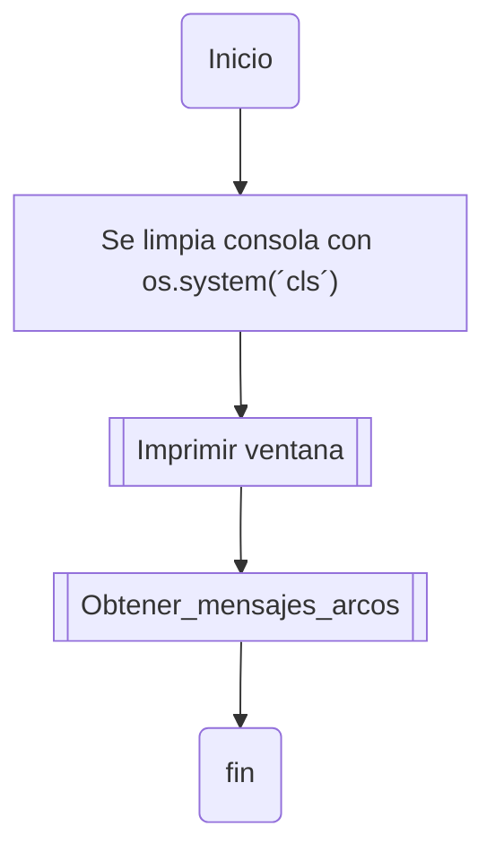

Además, el archivo JSOn con la histora está organizado de la siguiente manera, cada bloque con sus parámetros:
```python
{
  "arco1": {
    "titulo": "El Inicio",
    "mensajes": [
      {
        "id": "mensaje1",
        "texto": "Hora: 5:34 am - 5 de septiembre\n",
        "orientacion": true
      },
      {
        "id": "mensaje2",
        "texto": "Llego al parque en un taxi\n", 
        "orientacion": true,
        "imagen" : "taxi.txt"
        },
      {
        "id": "mensaje3",
        "texto": "[Taxista] son 15.000 pesos\n",
        "orientacion": false
      },
      {
        "id": "mensaje4",
        "texto": "[Diego Mendoza]: Ya le pago\n",
        "orientacion": true,
        "alternativas": {
          "a": ["Bajarse del taxi\n", "Gracias por el servicio\n"],
          "b": ["No bajarse del taxi\n", "[Taxista]: Señor, ya hemos llegado\n"]
      }
    ]
   }
}
```
### Función imprimir_ventana
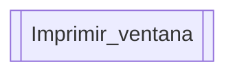
La función imprimir_ventana se encarga de imprimir la ventana de juego con unas dimensiones establecidas.
```python
def imprimir_ventana():
    """
    Imprime una ventana gráfica de diálogo e interacción en la terminal.
    
    Args:
        No recibe argumentos.
    
    Returns:
        int: La altura del área de diálogo de la ventana.
    """
    altura_dialogo = 15  # Altura de la sección de diálogo.
    altura_interaccion = 8  # Altura de la sección de interacción.
    
    # Copia la altura de la sección de diálogo.
    linea_actual = deepcopy(altura_dialogo)
    
    # Imprime la línea superior de la ventana.
    print("-" * 82)
    
    # Imprime la sección de diálogo de la ventana.
    for _ in range(altura_dialogo):
        print("|" + " " * 80 + "|")
    
    # Imprime la línea divisoria entre diálogo e interacción.
    print("-" * 82)
    
    # Imprime la sección de interacción de la ventana.
    for _ in range(altura_interaccion):
        print("|" + " " * 80 + "|")
    
    # Imprime la línea inferior de la ventana.
    print("-" * 82)
    
    return linea_actual
```
### Función obtener_mensajes_arcos
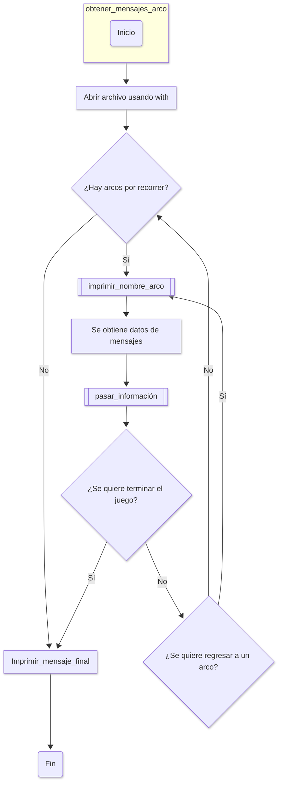
La función obtener_mensajes_arcos se encarga de tomar mensaje por mensaje, teniendo en cuenta en qué arco se esta jugando.
```python
def obtener_mensajes_arcos(linea_actual: int):
    """

    Esta función lee los mensajes de diferentes arcos narrativos,
    los almacena en una lista y los presenta al usuario. Se encarga
    de gestionar el avance a través de los arcos y de interactuar
    con el juego según la progresión del usuario.
    
    Args:
        linea_actual (int): La línea actual para la interacción.
    
    Returns:
        list: Una lista de mensajes obtenidos de los arcos.
    """

    paquete_mensajes = []  # Lista para almacenar los mensajes obtenidos.
    
    # Abre el archivo "historia_prueba.json" en modo lectura.
    with open("historia_prueba.json", "r", encoding="utf-8") as archivo:

        # Lee el contenido del archivo.
        contenido = archivo.read()
    
    # Carga el contenido JSON en un diccionario de datos.
    datos_lectura = json.loads(contenido)
    
    contador_arcos = 0  # Inicializa el contador de arcos.
    nombres_arcos = list(datos_lectura.keys())  # Obtiene los nombres de arcos.
    lista_avance = []  # Lista para almacenar el avance en los arcos.
    arco_actual = nombres_arcos[contador_arcos]  # Arco actual a procesar.
    
    while contador_arcos < len(nombres_arcos):
        # Imprime el nombre del arco actual.
        imprimir_nombre_arco(arco_actual)
        lista_avance.append(arco_actual)  # Agrega el arco actual a la lista.
        
        contenido_mensajes = datos_lectura[arco_actual].get("mensajes")
        cantidad_seccion = 0  # Inicializa la cantidad de secciones.
        
        paquete_mensajes = []  # Reinicia la lista de mensajes.
        
        # Almacena los mensajes del arco actual.
        for mensaje in contenido_mensajes:
            paquete_mensajes.append(mensaje)
        
        # Pasa la información de los mensajes.
        pasar_informacion(paquete_mensajes, linea_actual, cantidad_seccion)
        
        contador_arcos += 1  # Incrementa el contador de arcos.
        
        bandera_arco = True  # Bandera para indicar el estado del arco.
        
        # Llama a la función para verificar el estado del juego.
        (bandera_arco,
         contador_arcos, nombres_arcos) = terminar_juego(bandera_arco, 
                                                         contador_arcos,
                                                         nombres_arcos)
        
        while bandera_arco == True:
            # Restaura el arco actual si es necesario.
            (arco_actual, lista_avance,
             contador_arcos, bandera_arco) = restaurar_arco(contador_arcos, 
                                                            lista_avance,
                                                            arco_actual, 
                                                            nombres_arcos,
                                                            bandera_arco)
    
    linea = 22  # Establece la línea para el mensaje final.
    posicionar_linea(linea)  # Posiciona la línea en la salida.
    
    # Imprime líneas vacías para el formato.
    for _ in range(2):
        print("|" + " " * 80)
    
    linea = 1  # Reinicia la línea para el mensaje final.
    posicionar_linea(linea)  
    
    mensaje_final = ("| Gracias por jugar. ¡Hasta la próxima!\n\n"
                     "| Créditos:\n| Programado y escrito por:"
                     " Juan José Tobar y Jospeh Lievano")
    
    # Imprime el mensaje final carácter por carácter.
    for caracter in mensaje_final:
        print(caracter, end="", flush=True)
        sleep(0.03)  # Agrega un pequeño retardo entre caracteres.
    
    linea = 26  # Establece la línea final para el formato.
    posicionar_linea(linea)  
    
    return paquete_mensajes  # Devuelve la lista de mensajes obtenidos.
```
### Función imprimir_nombre_arco
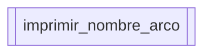
La función imprimir_nombre_arco se encarga de tomar el nombre del arco e imprimirlo.
```python
def imprimir_nombre_arco(nombre_arco: str) -> None:
    """
    Imprime el nombre de un arco con formato especial en la consola.

    Args:
        nombre_arco (str): Nombre del arco a imprimir.

    Returns:
        None
    """
    linea = 1  # Establece la línea para posicionar el nombre del arco.
    posicionar_linea(linea)  # Posiciona la línea en la salida.

    # Formatea el nombre del arco con capitalización.
    nombre_arco = nombre_arco[:-1].capitalize() + " " + nombre_arco[-1::]
    print("| ", end="")  # Imprime el prefijo antes del nombre.

    # Imprime cada carácter del nombre del arco con un retardo.
    for caracter in nombre_arco:
        print(caracter, end="", flush=True)
        sleep(0.1)  # Retardo entre caracteres para un efecto visual.

    linea = 23  # Establece la línea para el mensaje de continuación.
    posicionar_linea(linea)  # Posiciona la línea en la salida.
    input("| Presione enter para continuar:")  # Espera a que el usuario presione Enter.
```
### Función pasar_información
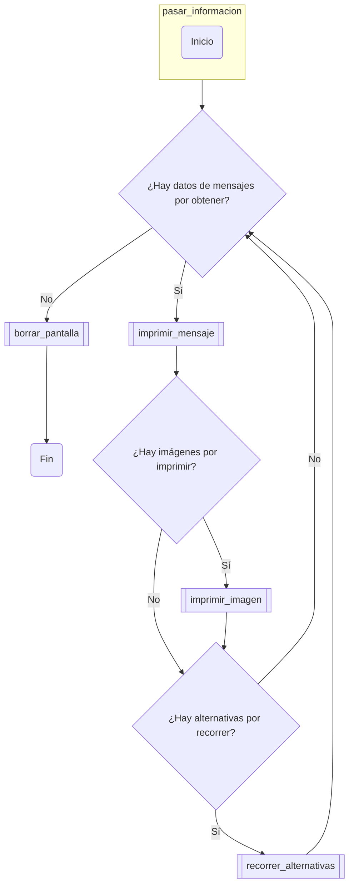
La función pasar_información se encarga de tomar la información en el JSON, por bloques, e imprimir de acuerdo a los criterios que da el bloque.
```python
def pasar_informacion(paquete_mensajes: list, 
                      linea_actual: int, cantidad_seccion: int) -> None:
    """
    La función recorre cada paquete de mensajes y lo muestra en pantalla.
    También gestiona la impresión de imágenes y alternativas según el contenido
    del paquete.
    
    Args:
        paquete_mensajes (list): Lista de mensajes a procesar.
        linea_actual (int): Línea actual en la que se está mostrando el mensaje.
        cantidad_seccion (int): Cantidad de secciones mostradas.

    Returns:
        None
    """
    lista_secciones = []  # Lista para almacenar secciones de mensajes.

    constante_linea = 1  # Constante para la línea de impresión.
    constante_rango = 1  # Constante para el rango de impresión.

    # Procesa cada paquete de mensajes en la lista.
    for paquete in paquete_mensajes:
        orientacion_paquete = []  # Lista para almacenar orientación del paquete.

        mensaje_actual = (paquete.get("texto"))  # Obtiene el texto del mensaje.

        # Agrega la orientación y el mensaje a la lista de secciones.
        orientacion_paquete.append(paquete.get("orientacion"))
        orientacion_paquete.append(mensaje_actual)
        lista_secciones.append(orientacion_paquete)

        # Imprime el mensaje y actualiza las variables.
        (linea_actual, cantidad_seccion,
         constante_linea, constante_rango, lista_secciones) = imprimir_mensaje(linea_actual, cantidad_seccion, 
                                                                               lista_secciones, constante_linea, 
                                                                               constante_rango)

        linea = 23  # Línea para posicionar el siguiente mensaje.
        posicionar_linea(linea)  # Posiciona la línea en la salida.

        input("| Presione enter para continuar:")  # Espera entrada del usuario.

        # Si hay una imagen en el paquete, la imprime.
        if paquete.get("imagen"):
            archivo_imagen = paquete.get("imagen")  # Obtiene la imagen.
            borrar_pantalla()  # Limpia la pantalla.
            imprimir_imagen(archivo_imagen)  # Imprime la imagen.

        # Si hay alternativas en el paquete, las procesa.
        if paquete.get("alternativas"):
            alternativas = paquete.get("alternativas")  # Obtiene las alternativas.

            # Procesa las alternativas y actualiza las variables.
            (linea_actual, cantidad_seccion,
             constante_linea, constante_rango, lista_secciones) = recorrer_alternativas(alternativas, linea_actual, 
                                                                                        cantidad_seccion, constante_linea, constante_rango, lista_secciones)

    borrar_pantalla()  # Limpia la pantalla al finalizar.

```
### Función borrar_pantalla
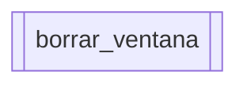
La función borrar_pantalla se encarga de imprimir una nueva linea en blanco, dando el efeco de borrado.
```python
def borrar_pantalla() -> None:
    """
    Borra el contenido de la pantalla desplazando el cursor hacia arriba.

    Args:
        None

    Returns:
        None
    """
    LINE_UP = '\033[1A'  # Secuencia de escape ANSI para mover el cursor arriba

    # Mover el cursor hacia arriba 100 líneas para limpiar la pantalla
    for _ in range(100):
        print(LINE_UP, end="")

    print("")  # Imprimir una línea en blanco para separar el contenido

    # Imprimir líneas vacías para simular el borrado de la pantalla
    for _ in range(15):
        print("|" + " " * 80)
```
### Función imprimir_mensaje
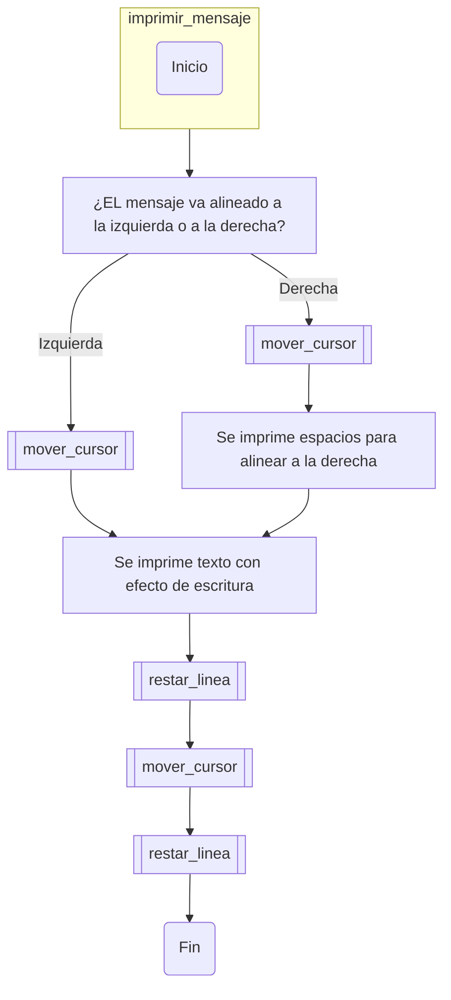
La función imprimir_mensaje se encarga de imprimir los mensajes ya rebanados en frases y con la ilusión de que se están escribiendo las palabras por teclado.
El criterio para dividir los mensajes en frases es la longitud de las frases establecida por la variable ancho_texto.
```python
def imprimir_mensaje(seccion_escritura: list, lista_mensajes: list, linea_actual: int,
                     ancho_pantalla: int, sublista: int, rango_mensaje: int):
    """
    Imprime un mensaje sección por sección con un efecto de escritura.

    Args:
        seccion_escritura (list): Lista de secciones de texto a imprimir.

        lista_mensajes (list): Lista de listas que contiene los mensajes y
        su estado de visualización.

        linea_actual (int): Línea actual en la pantalla donde se imprimirá.

        ancho_pantalla (int): Ancho de la pantalla para ajustar el texto.

        sublista (int): Índice de la sublista en 'lista_mensajes' que contiene 
        el mensaje a imprimir.

        rango_mensaje (int): Rango del mensaje a imprimir en la pantalla.

    Returns:
        tuple: Una tupla que contiene la línea actual y el rango de mensaje
        actualizados.
    """
    # Verificar si el mensaje en la sublista está activo para impresión
    if lista_mensajes[sublista][0] == True:

        # Mover el cursor y obtener la línea actual y rango de mensaje
        linea_actual, rango_mensaje = mover_cursor(linea_actual, rango_mensaje,
                                                   lista_mensajes)
        
        print("| ", end="")  # Imprimir el delimitador inicial de la línea

        # Iterar sobre cada palabra en la sección de escritura
        for palabra in seccion_escritura:

            # Imprimir cada carácter de la palabra con un efecto de escritura
            for caracter in palabra:
                print(caracter, end="", flush=True)
                sleep(0.02)  # Pausa breve para efecto de escritura
            
            # Borrar la pantalla después de imprimir una palabra
            borrar_pantalla(ancho_pantalla)

            # Ajustar la línea actual y rango de mensaje después de la impresión
            linea_actual -= 1
            rango_mensaje -= 1

            # Mover el cursor de nuevo para la siguiente palabra
            linea_actual, rango_mensaje = mover_cursor(linea_actual, rango_mensaje,
                                                       lista_mensajes)
            print("| ", end="")  # Imprimir el delimitador de la nueva línea

    else:
        # Si el mensaje no está activo, borrar la pantalla
        borrar_pantalla(ancho_pantalla)
        linea_actual -= 1

        # Mover el cursor y obtener la línea actual y rango de mensaje
        linea_actual, rango_mensaje = mover_cursor(linea_actual, rango_mensaje,
                                                   lista_mensajes)
        print('\n', end="")  # Mover a la nueva línea sin imprimir nada

        # Iterar sobre cada palabra en la sección de escritura
        for palabra in seccion_escritura:
            print("|" + " " * 18, end="")  # Imprimir espacio inicial

            # Imprimir cada carácter de la palabra con un efecto de escritura
            for caracter in palabra:
                print(caracter, end="", flush=True)
                sleep(0.02)  # Pausa breve para efecto de escritura

            # Borrar la pantalla después de imprimir una palabra
            borrar_pantalla(ancho_pantalla)

            # Ajustar la línea actual y rango de mensaje después de la impresión
            linea_actual -= 1
            rango_mensaje -= 1

            # Mover el cursor de nuevo para la siguiente palabra
            linea_actual, rango_mensaje = mover_cursor(linea_actual, rango_mensaje,
                                                       lista_mensajes)

    # Retornar la línea actual y rango de mensaje actualizados
    return linea_actual, rango_mensaje
```
### Función mover_cursor
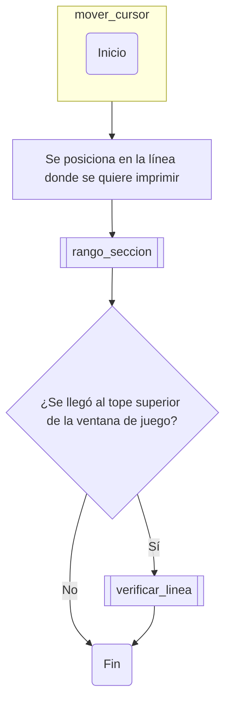
La función mover_cursor se encarga de mover el cursor a la línea donde se va imprimiendo el mensaje, teniendo también en cuenta cuántas líneas caben en la pantalla de juego.
```python
def mover_cursor(linea_actual: int, 
                 cantidad_seccion: int, lista_secciones: list, 
                 constante_linea: int, constante_rango: int) -> tuple:
    """          
    Mueve el cursor de la consola a la posición de la línea deseada y ajusta 
    el rango de impresión de mensajes. También verifica y ajusta las variables
    relacionadas con el control de la impresión en función de la línea y
    sección actuales.
    
    Args:
        linea_actual (int): Línea actual en la consola.
        cantidad_seccion (int): Cantidad de secciones impresas.
        lista_secciones (list): Lista de secciones con mensajes.
        constante_linea: Constante utilizada para controlar la línea.
        constante_rango: Rango utilizado para controlar la impresión.

    Returns:
        tuple: Línea actual, cantidad de secciones, constante de línea,
               constante de rango y lista de secciones actualizada.
    """
    LINE_UP = '\033[1A'  # Secuencia para mover el cursor hacia arriba

    # Mover el cursor hacia arriba 100 líneas
    for _ in range(100):
        print(LINE_UP, end="")

    # Imprimir líneas vacías hasta alcanzar la línea actual
    for _ in range(linea_actual):
        # Si es la última línea y no es la 14, ajustar el rango del mensaje
        if _ == linea_actual - 1 and _ != 14:
            print("")  # Imprimir línea vacía
            cantidad_seccion, linea_actual = rango_seccion(lista_secciones, cantidad_seccion, linea_actual)

        else:
            print("")  # Imprimir línea vacía

    if _ == 0 and linea_actual == 1:
        # Verificar y ajustar la línea si es necesario
        (linea_actual, constante_linea,
         constante_rango, lista_secciones) = verificar_linea(linea_actual, constante_linea,
                                                             constante_rango, lista_secciones)

    # Devolver la línea actual y el rango de mensaje actualizados
    return linea_actual, cantidad_seccion, constante_linea, constante_rango, lista_secciones
```
### Función rango_seccion
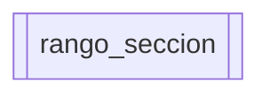
La función rango_seccion se encarga de poner el mensaje dentro del rango que se puede en la pantalla de juego.
```python
def rango_seccion(lista_secciones: list, 
                  cantidad_seccion: int, linea_actual: int) -> tuple:
    """
    Muestra un rango de secciones en la interfaz, ajustando el índice según sea
    necesario.
    
    Args:
        lista_secciones (list): Lista de secciones disponibles.
        cantidad_seccion (int): Número de secciones a mostrar.
        linea_actual: La línea actual en la consola.

    Returns:
        tuple: Cantidad de secciones y línea actual.
    """
    i = 0         # Inicializa el índice de la línea actual
    seccion = 0   # Inicializa el índice de la sección actual

    # Bucle para ajustar el rango de secciones a mostrar
    while i < cantidad_seccion:
        # Llama a imprimir_seccion para mostrar la sección actual
        seccion, i, lista_secciones = imprimir_seccion(lista_secciones, seccion, i)

        # Actualiza los índices para la próxima sección
        seccion += 1
        i += 1

    # Retorna la cantidad de secciones y la línea actual
    return cantidad_seccion, linea_actual
```
### Función verificar_linea
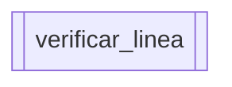
La función verificar_linea se encarga de hacer que la linea quede en su lugar sin mover otros elementos.
```python
def verificar_linea(linea_actual: int, constante_linea: int, 
                    constante_rango: int, lista_secciones: list) -> tuple:
    """
    Ajusta las constantes de línea y rango a cero, eliminando la primera
    sección de la lista para avanzar en la narrativa.

    Args:
        linea_actual (int): La línea actual en la consola.
        constante_linea: Valor que representa la línea constante.
        constante_rango: Valor que representa el rango constante.
        lista_secciones (list): Lista de secciones disponibles.

    Returns:
        tuple: Línea actual, constante de línea, constante de rango y lista de
        secciones.        
    """
    constante_linea = 0  # Reinicia la constante de línea
    constante_rango = 0  # Reinicia la constante de rango

    lista_secciones.pop(0)  # Elimina la primera sección de la lista

    # Devuelve los parámetros actualizados
    return linea_actual, constante_linea, constante_rango, lista_secciones
```
### Función restar_linea
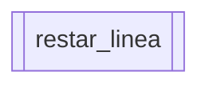
La función restar_linea se encarga de quitar las líneas que van saliendo de la pantalla de juego.
```python
def restar_linea(linea_actual: int, 
                 cantidad_seccion: int, constante_rango: int) -> tuple:
    """
    Ajusta la posición de la línea y el rango de sección para el texto. Además,
    maneja las condiciones de retroceso de línea y reinicio de rango.

    Args:
        linea_actual (int): La línea actual en la consola.
        cantidad_seccion (int): La cantidad de secciones impresas.
        constante_rango: Rango utilizado para controlar la impresión.

    Returns:
        tuple: Línea actual, cantidad de secciones y constante de rango.
    """
    # Verifica si la línea actual y la cantidad de secciones son válidas
    if linea_actual != 1 and cantidad_seccion != 10:
        linea_actual -= 1  # Reduce la línea actual si es necesario

    elif linea_actual == 1 and cantidad_seccion == 7:
        linea_actual = 2  # Cambia la línea actual a 2
        constante_rango = 0  # Reinicia el rango

    # Devuelve la línea actual y el rango de sección actualizados
    return linea_actual, cantidad_seccion, constante_rango
```
### Función imprimir_imagen
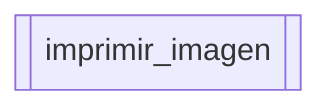
La función imprimir_imagen se encarga de imprimir las imágenes ASCII.
```python
def imprimir_imagen(archivo_imagen: str) -> None:
    """
    Imprime una imagen ASCII desde un archivo, carácter por carácter, con 
    un efecto de escritura progresiva. 

    Args:
        archivo_imagen (str): Ruta del archivo que contiene la imagen ASCII.

    Returns:
        None
    """
    linea = 1  # Posiciona el cursor en la línea 1.
    posicionar_linea(linea)

    # Abre el archivo de imagen en modo lectura.
    with open(archivo_imagen, 'r') as archivo:
        arte_ascii = archivo.read()  # Lee el contenido del archivo.

    # Imprime cada carácter de la imagen ASCII con un retardo.
    for caracter in arte_ascii:
        print(caracter, end="", flush=True)
        sleep(0.005)

    linea = 23  # Posiciona el cursor en la línea 23.
    posicionar_linea(linea)

    # Solicita al usuario que presione enter para continuar.
    input("| Presione enter para continuar:")
```
### Función imprimir_alternativas
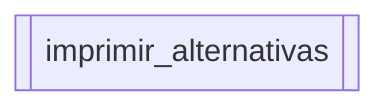
La función imprimir_alternativas se encarga de imprimir las opciones del jugador, luego imprime la respuesta a esa elección.
```python
def imprimir_alternativas(alternativas: dict) -> tuple:
    """
    Imprime las opciones disponibles con un efecto de escritura animada 
    y solicita al usuario que seleccione una de ellas.

    Args:
        alternativas (dict): Opciones disponibles para el usuario.

    Returns:
        tuple: Opción seleccionada por el usuario y las alternativas restantes.
    """
    LINE_UP = '\033[1A'  # Control de línea para mover el cursor hacia arriba.

    # Imprime cada alternativa con su respectiva clave y valor.
    for clave, valor in alternativas.items():
        posibilidad = "| " + clave + ") " + valor[0]  # Formato de la opción.

        # Imprime cada carácter de la opción con un retardo.
        for caracter in posibilidad:
            print(caracter, end="", flush=True)
            sleep(0.02)

    # Posiciona el cursor para las siguientes entradas del usuario.
    linea = 22
    posicionar_linea(linea)

    # Limpia el área para que el usuario pueda ver la siguiente instrucción.
    for _ in range(2):
        print("|" + " " * 70)

    print(LINE_UP, end="")  # Mueve el cursor hacia arriba.

    # Solicita la opción del usuario, normalizando la entrada.
    opcion = input("| Seleccione una opción:").lower().replace(" ", "")

    return opcion, alternativas  # Devuelve la opción y alternativas restantes.
```
