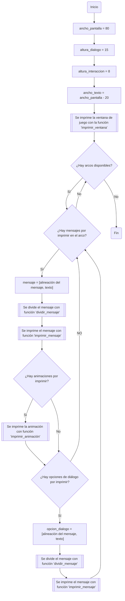

# Proyecto programación

## Pseudocódigo

```mermaid
flowchart TD
    A(Inicio) --> B
    B[ancho_pantalla = 80] -->C[altura_dialogo = 15]
    C --> D[altura_interaccion = 8]
    D --> E[ancho_texto = ancho_pantalla - 20]
    E --> F[["Se imprime la ventana de juego con la función 'imprimir_ventana'"]]
    F --> G{¿Hay arcos disponibles?}
    G -- Sí --> H{¿Hay mensajes por imprimir en el arco?}
        H -- Sí --> I["mensaje = [alineación del mensaje, texto]"]
            I --> J[["Se divide el mensaje con función 'dividir_mensaje'"]]
            J --> K[["Se imprime el mensaje con función 'imprimir_mensaje'"]]
            K --> L{¿Hay animaciones por imprimir?}
                L -- Sí --> M[["Se imprime la animación con función 'imprimir_animación'"]]
                    M --> N{¿Hay opciones de diálogo por imprimir?}
                    N -- Sí --> O["opcion_dialogo = [alineación del mensaje, texto]"]
                        O --> P[["Se divide el mensaje con función 'dividir_mensaje'"]]
                        P --> Q[["Se imprime el mensaje con función 'imprimir_mensaje'"]]
                        Q --> H
                    N -- NO --> H
                L -- No --> N
        H -- No --> G
    G -- No --> R(Fin)
```
