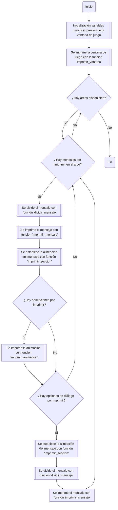
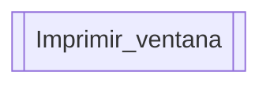
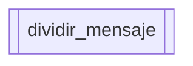
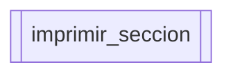
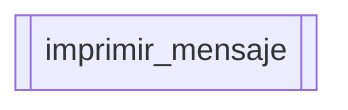
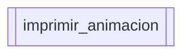
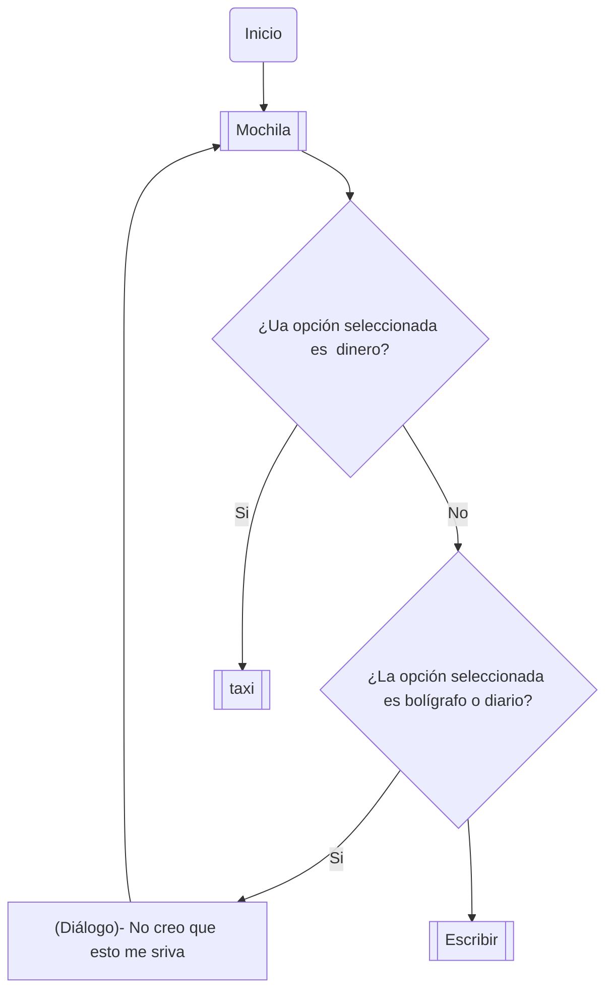
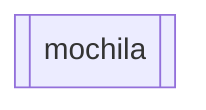
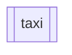
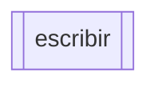

# Proyecto programación
# Índice
1. [Historia](#historia)
2. [Funcionamiento](#funcionamiento)
    1. [Estructuar general del juego](#estructuar-general-del-juego)
        1. [Inicialización de variables para la ventana de juego](#inicialización-de-variables-para-la-ventana-de-juego)
        2. [Función imprimir_ventana](#función-imprimir_ventana)
        3. [Función dividir_mensaje](#función-dividir_mensaje)
        4. [Función imprimir_seccion](#función-imprimir_seccion)
        5. [Función imprimir_mensaje](#función-imprimir_mensaje)
        6. [Función imprimir_animacion](#función-imprimir_animacion)
    2. [Estructura mecánicas del juego](#estructura-mecánicas-del-juego)
        1. [Función taxi](#función-taxi)
        2. [Función diario](#función-diario)

## Historia
Nombres tentativos: Sin tregua, Sombras de una muerte

Resumen: El detective Mendoza tiene una vida normal resolviendo crímenes, hasta que sucede la muerte de un ser querido. En principio no significa mucho, un caso más en el historial. Pero esto le termina arrebatando lo que más quiere en el mundo y haciéndole reencontrarse con un viejo conocido.

## Funcionamiento
Versión de python requerida: 3.6 en adelanta
Tipo de juego: Novela visual de arte ASCII
La siguiente sección contiene el diagrama de flujo del juego. Se empieza con una estrucutar general y seguida de esta se presentan las explicaciones específicas
### Estructuar general del juego



### Inicialización de variables para la ventana de juego
Para la impresión de la ventana de juego se establece que:     
* El ancho de la pantalla es de 80 racacteres.
* La altura de la ventana de diálogo es de 15 caracteres.
* La altura de la ventana de interación es de 8 caractres.
* El ancho máximo del texto impreso en la ventana de diálogo es de 60 caracteres.
```python
ancho_pantalla = 80
altura_dialogo = 15
altura_interaccion = 8
ancho_texto = ancho_pantalla - 20
```

### Función imprimir_ventana

La función imprimir_ventana se encarga de imprimir la ventana de juego con unas dimensiones establecidas.
```python
def imprimir_ventana(ancho_pantalla : int, altura_dialogo : int, 
                     altura_interaccion: int):
    """
    Imprime una representación de una ventana de diálogo con una sección de
    interacción en la consola.
    

    Args:
        ancho_pantalla (int): El ancho de la ventana.

        altura_dialogo (int): La altura de la sección de diálogo de la ventana.

        altura_interaccion (int): La altura de la sección de interacción de la
        ventana.
        
    Returns:
        None
    """
    # Imprimir la línea superior de la ventana
    print("-" * (ancho_pantalla + 2))
    
    # Imprimir la sección de diálogo de la ventana
    for _ in range(altura_dialogo):
        print("|" + " " * ancho_pantalla + "|")
    
    # Imprimir la línea divisoria entre la sección de diálogo y la de interacción
    print("-" * (ancho_pantalla + 2))
    
    # Imprimir la sección de interacción de la ventana
    for _ in range(altura_interaccion):
        print("|" + " " * ancho_pantalla + "|")
    
    # Imprimir la línea inferior de la ventana
    print("-" * (ancho_pantalla + 2))
```

### Función dividir_mensaje

La función dividir_mensaje se encarga de tomar el mensaje y dividirlo según el ancho de la pantalla. Si no cabe, hace nuevos renglones.
```python
def dividir_mensaje(lista_mensajes: list, ancho_pantalla: int,
                    sublista: int, seccion_escritura: list):
    """
    Divide un mensaje en secciones según el ancho de pantalla disponible.

    Args:
        lista_mensajes (list): Lista de listas que contiene mensajes.

        ancho_pantalla (int): El ancho de la pantalla para ajustar el texto.

        sublista (int): Índice de la sublista que contiene el mensaje a dividir.

        seccion_escritura (list): Lista donde se almacenarán las secciones del 
        mensaje dividido.

    Returns:
        tuple: Contiene la lista de secciones del mensaje dividido y la lista 
        de mensajes actualizada.
    """
    # Obtener el mensaje de la sublista especificada
    mensaje = lista_mensajes[sublista][1]
    
    # Eliminar el mensaje original de la sublista
    lista_mensajes[sublista].remove(lista_mensajes[sublista][1])
    
    # Inicializar la lista para almacenar las secciones del mensaje
    seccion_escritura = []
    
    # Calcular el ancho máximo del texto permitido en una línea
    ancho_texto = ancho_pantalla - 20
    
    # Inicializar contadores para recorrer el mensaje
    recorrido = 0
    contador = 0
    
    # Bandera para controlar el bucle de división
    bandera = True

    # Bucle para dividir el mensaje en secciones según el ancho de texto
    while recorrido < len(mensaje) and bandera:
        # Guardar el índice del último espacio antes del límite de ancho
        if mensaje[contador] == " " and contador < ancho_texto:
            indice = contador
        
        # Si se alcanza el ancho de texto, cortar mensaje y agregar a lista
        elif ancho_texto <= contador:
            seccion_escritura.append(mensaje[:indice])
            mensaje = mensaje[indice:].lstrip()  # Eliminar espacios al inicio
            recorrido = 0
            contador = 0
        
        # Si el mensaje restante es menor que el ancho de texto, agregar a la
        # lista
        
        elif len(mensaje) < ancho_texto:
            seccion_escritura.append(mensaje)
            bandera = False
        
        recorrido += 1
        contador += 1

    # Agregar las secciones del mensaje dividido a la sublista correspondiente
    lista_mensajes[sublista].append(seccion_escritura)

    # Devolver la lista de secciones y la lista de mensajes actualizada
    return seccion_escritura, lista_mensajes
```
### Función imprimir_seccion

La función imprimir sección se encarga de imprimir las secciones del mensaje dividido según una orientación establecida.
```python
def imprimir_seccion(lista_mensajes: list, contador: int, frase: int, 
                     seccion: int, i: int):
    """
    Imprime una sección de un mensaje basado en el estado actual y parámetros.

    Args:
        lista_mensajes (list): Lista de listas que contiene los mensajes y 
        su estado de visualización.

        contador (int): Índice del mensaje en la lista que se está procesando.
        
        frase (int): Índice de la frase dentro del mensaje actual.

        seccion (int): Índice de la sección actual dentro del mensaje.

        i (int): Línea actual en la pantalla donde se imprimirá el mensaje.

    Returns:
        tuple: Una tupla que contiene los valores actualizados de frase, 
               seccion, i, contador y lista_mensajes.
    """
    # Imprimir la línea del mensaje según el estado activo
    if lista_mensajes[contador][0] == True:
        print("| " + lista_mensajes[contador][1][frase])
    else:
        print("| " + " " * 18 + lista_mensajes[contador][1][frase])

    # Actualizar los índices para la próxima sección
    frase += 1
    seccion += 1
    i += 1

    # Devolver los valores actualizados
    return frase, seccion, i, contador, lista_mensajes
```

### Función imprimir_mensaje

La función imprimir_mensaje se encarga de imprimir los mensajes ya rebanados en frases y con la ilusión de que se están escribiendo las palabras por teclado.
El criterio para dividir los mensajes en frases es la longitud de las frases establecida por la variable ancho_texto.
```python
def imprimir_mensaje(seccion_escritura: list, lista_mensajes: list, linea_actual: int,
                     ancho_pantalla: int, sublista: int, rango_mensaje: int):
    """
    Imprime un mensaje sección por sección con un efecto de escritura.

    Args:
        seccion_escritura (list): Lista de secciones de texto a imprimir.

        lista_mensajes (list): Lista de listas que contiene los mensajes y
        su estado de visualización.

        linea_actual (int): Línea actual en la pantalla donde se imprimirá.

        ancho_pantalla (int): Ancho de la pantalla para ajustar el texto.

        sublista (int): Índice de la sublista en 'lista_mensajes' que contiene 
        el mensaje a imprimir.

        rango_mensaje (int): Rango del mensaje a imprimir en la pantalla.

    Returns:
        tuple: Una tupla que contiene la línea actual y el rango de mensaje
        actualizados.
    """
    # Verificar si el mensaje en la sublista está activo para impresión
    if lista_mensajes[sublista][0] == True:

        # Mover el cursor y obtener la línea actual y rango de mensaje
        linea_actual, rango_mensaje = mover_cursor(linea_actual, rango_mensaje,
                                                   lista_mensajes)
        
        print("| ", end="")  # Imprimir el delimitador inicial de la línea

        # Iterar sobre cada palabra en la sección de escritura
        for palabra in seccion_escritura:

            # Imprimir cada carácter de la palabra con un efecto de escritura
            for caracter in palabra:
                print(caracter, end="", flush=True)
                sleep(0.02)  # Pausa breve para efecto de escritura
            
            # Borrar la pantalla después de imprimir una palabra
            borrar_pantalla(ancho_pantalla)

            # Ajustar la línea actual y rango de mensaje después de la impresión
            linea_actual -= 1
            rango_mensaje -= 1

            # Mover el cursor de nuevo para la siguiente palabra
            linea_actual, rango_mensaje = mover_cursor(linea_actual, rango_mensaje,
                                                       lista_mensajes)
            print("| ", end="")  # Imprimir el delimitador de la nueva línea

    else:
        # Si el mensaje no está activo, borrar la pantalla
        borrar_pantalla(ancho_pantalla)
        linea_actual -= 1

        # Mover el cursor y obtener la línea actual y rango de mensaje
        linea_actual, rango_mensaje = mover_cursor(linea_actual, rango_mensaje,
                                                   lista_mensajes)
        print('\n', end="")  # Mover a la nueva línea sin imprimir nada

        # Iterar sobre cada palabra en la sección de escritura
        for palabra in seccion_escritura:
            print("|" + " " * 18, end="")  # Imprimir espacio inicial

            # Imprimir cada carácter de la palabra con un efecto de escritura
            for caracter in palabra:
                print(caracter, end="", flush=True)
                sleep(0.02)  # Pausa breve para efecto de escritura

            # Borrar la pantalla después de imprimir una palabra
            borrar_pantalla(ancho_pantalla)

            # Ajustar la línea actual y rango de mensaje después de la impresión
            linea_actual -= 1
            rango_mensaje -= 1

            # Mover el cursor de nuevo para la siguiente palabra
            linea_actual, rango_mensaje = mover_cursor(linea_actual, rango_mensaje,
                                                       lista_mensajes)

    # Retornar la línea actual y rango de mensaje actualizados
    return linea_actual, rango_mensaje
```

### Función imprimir_animacion

La función imprimir_animacion se encarga de imprimir las animaciones que acompañan algunos diálogos de los arcos de la historia. Estas se crean utilizando caracteres ASCII.

### Estructura mecánicas del juego
El siguiente diagrama de flujo muestra la estructura de las funciones del juego como tal.

Primero, se presenta el funcionamiento del inventario:

### Función mochila

La función mochila se encarga de presentar al jugador su inventario, el cual es una lista.

### Función taxi

La función taxi se encarga de tomar el entero que representa el dinero del jugador, y le resta el valor de la carrera de taxi.
```python
#Función cuando se usa dinero en el taxi
def taxi (x:int)->int:
   x-=15000
   return x
```
### Función escribir

Es una función que se encarga de modificar el diario, que es una lista la cual guarda el texto que el jugador quiera, estas notas se pueden editar, borra o se pueden escribir unas nuevas.
```python
# 2. Diario y bolígrafo
bolígrafo=False
diario=[]
def escribir (x:str)->list:
#Se determina si el diario está en blanco, si está en blanco, solo da la opción de escribir o no escribir
    if len(diario)==0:
        print("El diario está en blanco)")
        while x==True:
            x=elección=input("\t(1).Escribir algo nuevo \n\t(2).No escribir nada\n\t")
            if elección=="1":
                diario.append(input("Escriba el texto que quiere añadir "))
            elif elección=="2":
                print("Continuando")
#Si el jugador escribe otor elemento, el programa piede al jugador escoger entre las dos opciones
            else:
                print("por favor, escoja alguna de las opciones")
                x=True
#Si no está en blanco, se imprime la lista y el jugador escoge si añade, elimina o edita notas, en el caso de editar, quita el elemento que se deasea y se inserta uno nuevo
    else:
        print(diario)
        while x==True:
            x=elección=input("\t(1). Escribir algo nuevo\n\t(2).Borrar un elemento \n\t(3).Editar un elemento \n\t")
        if elección=="1":
            diario.append(input("Escriba el texto que quiere añadir "))
        elif elección=="2":
            eliminar=int(input("Escriba el número de la nota que desea eliminar "))
            eliminar-=1
            diario.pop(eliminar)
#Para editar, se elimina el elemento de la lista y se añade la nueva nota en el mismo lugar
        elif elección=="3":
            modificar=int(input("Escriba el número de la nota que desea editar "))
            modificar-=1
            diario.pop(modificar)
            diario.insert(modificar,input("Escriba la nueva nota "))
#Si el jugador escribe otor elemento, el programa piede al jugador escoger entre las dos opciones
        else:
            print("Por favor, escoja alguna de las opciones")
            x=True
#Para ejecutar el diario
if __name__ == "__main__":
  x=True
  escribir(x)
#Si se ejecuta por el bolígrafo, se pondría esto
  if __name__ == "__main__":
    papelescribir=True
    while papelescribir==True:
#EL jugador escoge dónde escribir, se escoge el diario, se corre la función "escribir", si se escoge las cartas, no se permite porque son pruebas, si escribe otra cosa, el programa pide escoger una opción
        papelescribir=input("¿En dónde quieres escribir?\n\t(1).Diario\n\t(2).Cartas")
        if papelesescribir=="1":
            bolígrafo=True
            escribir(bolígrafo)
        elif papelesescribir=="2":
            print("´No puedo comprometer las purebas´")
        else:
            print("Por favor escoger una opción ")
            papelesescribir=True
