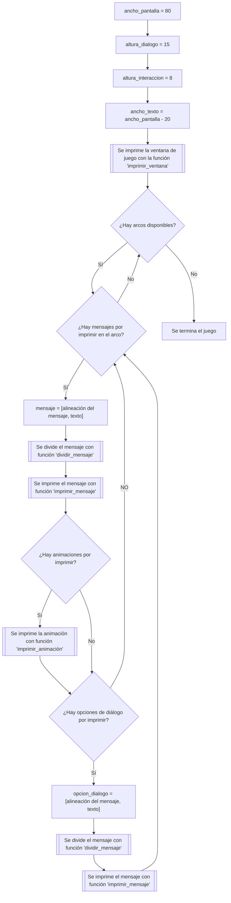

# Proyecto programación

## Pseudocódigo

```mermaid
flowchart TD
    A[ancho_pantalla = 80] -->B[altura_dialogo = 15]
    B --> C[altura_interaccion = 8]
    
    C --> D[ancho_texto = ancho_pantalla - 20]
    D --> E[["Se imprime la ventana de juego con la función 'imprimir_ventana'"]]
    E --> F{¿Hay arcos disponibles?}
    F -- Sí --> G{¿Hay mensajes por imprimir en el arco?}
        G -- Sí --> I["mensaje = [alineación del mensaje, texto]"]
            I --> J[["Se divide el mensaje con función 'dividir_mensaje'"]]
            J--> K[["Se imprime el mensaje con función 'imprimir_mensaje'"]]
            K--> L{¿Hay animaciones por imprimir?}
                L -- Sí --> M[["Se imprime la animación con función 'imprimir_animación'"]]
                    M --> N{¿Hay opciones de diálogo por imprimir?}
                    N -- Sí --> O["opcion_dialogo = [alineación del mensaje, texto]"]
                        O --> P[["Se divide el mensaje con función 'dividir_mensaje'"]]
                        P --> Q[["Se imprime el mensaje con función 'imprimir_mensaje'"]]
                        Q --> G
                    N -- NO --> G
                L -- No --> N
        G -- No --> F
    F -- No --> H[Se termina el juego]
```
