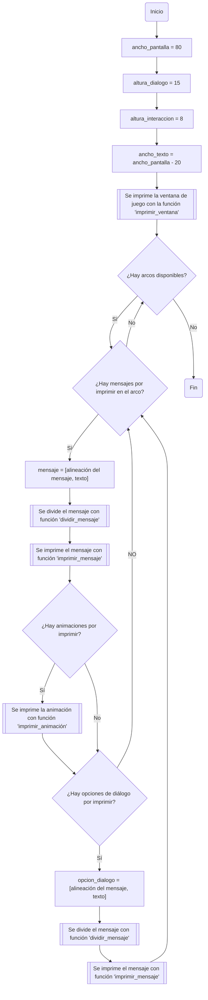
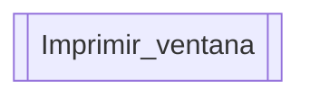
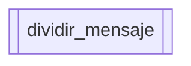
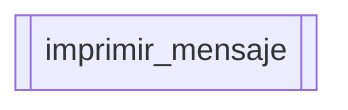
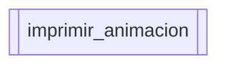
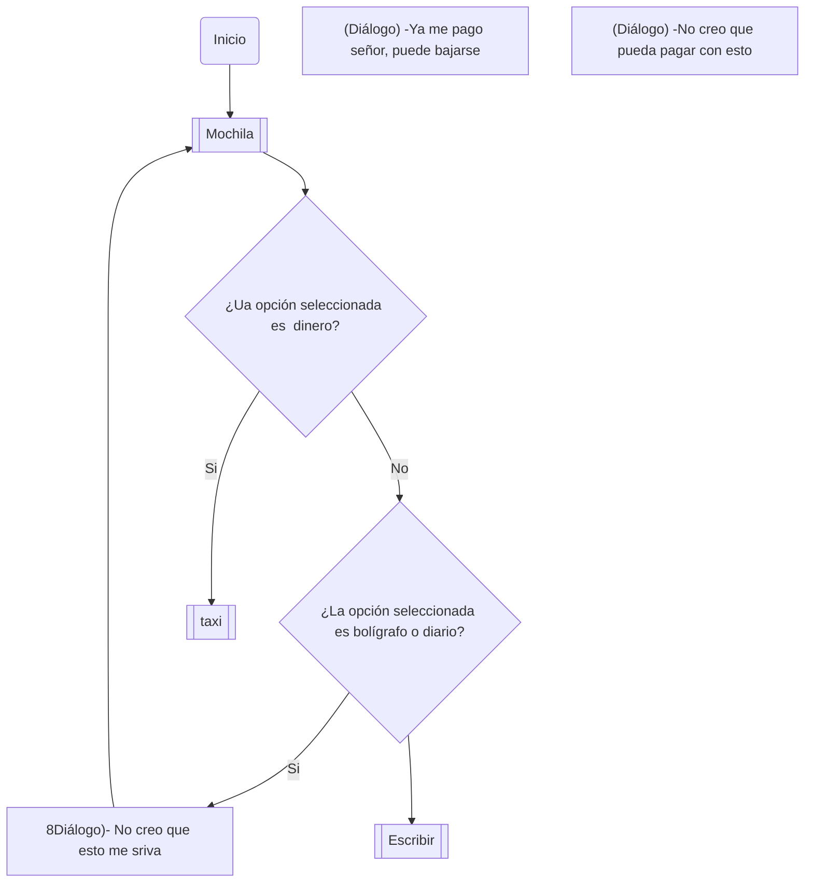
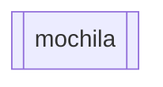
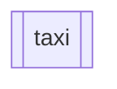
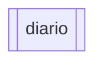

# Proyecto programación
# Índice
1. [Diagrama de flujo](#diagrama-de-flujo)
    1. [Estructuar general del juego](#estructuar-general-del-juego)
    2. [Función imprimir_mensaje](#función-imprimir_mensaje)
    3. [Función imprimir_animacion](#función-imprimir_animacion)
    4. [Estructura mecánicas del juego](#estructura-mecanicas-del-juego)
    5. [Función taxi](#función-taxi)
    6. [Función diario](#función-diario)

## Diagrama de flujo
La siguiente sección contiene el diagrama de flujo del juego. Se empieza con una estrucutar general y seguida de esta se presentan las explicaciones específicas
### Estructuar general del juego

### Función imprimir_ventana

La función imprimir_ventana se encarga de imprimir la ventana de juego con unas dimensiones establecidas.

### Función dividir_mensaje

La función dividir_mensaje se encarga de tomar el mensaje y dividirlo de tal manera que quepa en el ancho de la pantalla. Si no cabe, hace nuevos renglones.

### Función imprimir_mensaje

La función imprimir_mensaje se encarga de imprimir los mensajes ya rebanados en frases y con la ilusión de que se están escribiendo las palabras por teclado.
El criterio para dividir los mensajes en frases es la longitud de las frases establecida por la variable ancho_texto.

### Función imprimir_animacion

La función imprimir_animacion se encarga de imprimir las animaciones que acompañan algunos diálogos de los arcos de la historia. Estas se crean utilizando caracteres ASCII.

### Estructura mecánicas del juego
El siguiente diagrama de flujo muestra la estructura de las funciones del juego como tal.

Este primer pseudocódigo representa la función mochila, es decir, el inventario del jugador.

### Función mochila

La función mochila se encarga de presentar al jugador su inventario, el cual es una lista.

### Función taxi

La función taxi se encarga de tomar el entero que representa el dinero del jugador, y le resta el valor de la carrera de taxi.

### Función diario

Es una función que se encarga de modificar el diario, que es una lista la cual guarda el texto que el jugador quiera, estas notas se pueden editar, borra o se pueden escribir unas nuevas.
