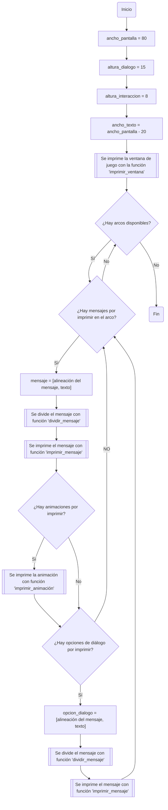
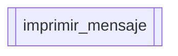
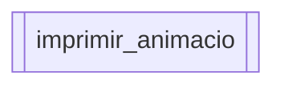

# Proyecto programación
# Índice

1. [Introducción](#introducción)
2. [Pseudocódigo](#pseudocódigo)
    1. [Estructuar general del juego](#estructuar-general-del-juego)
    2. [Función imprimir_mensaje](#función-imprimir_mensaje)
    3. [Función imprimir_animacion](#función-imprimir_animacion)

## Pseudocódigo
La siguiente sección contiene el diagrama de flujo del juego. Se empieza con una estrucutar general y seguida de esta las explicaciones específicas
### Estructuar general del juego

### Función imprimir_mensaje

Esta función se encarga de imprimir los mensajes ya rebanados en frases, esto con la ilusión de que se están escribiendo las palabra por teclado.
El criterio para dividir los mensajes en frases es la longitud de las frases establecida por la variable ancho_texto.

### Función imprimir_animacion

Esta función se encarga de las animaciones que acompañan algunos diálogos de los arcos de la historia. Esto se hace utilizando caracteres ASCII.
