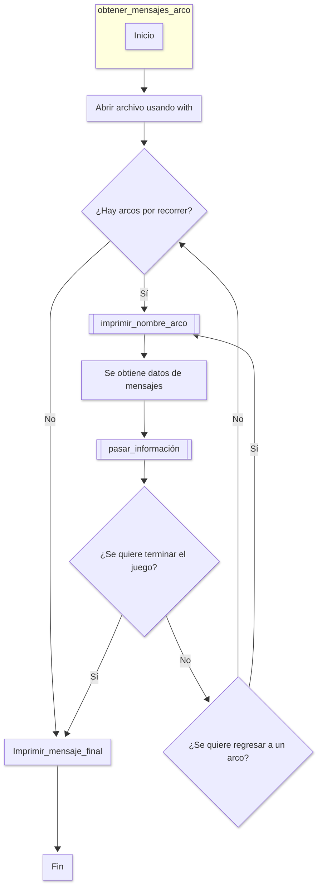
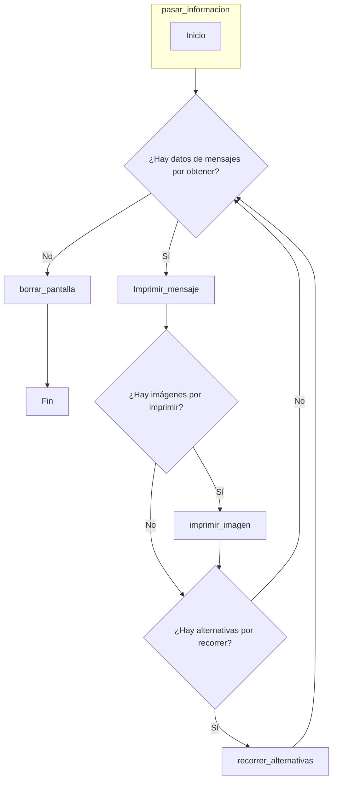
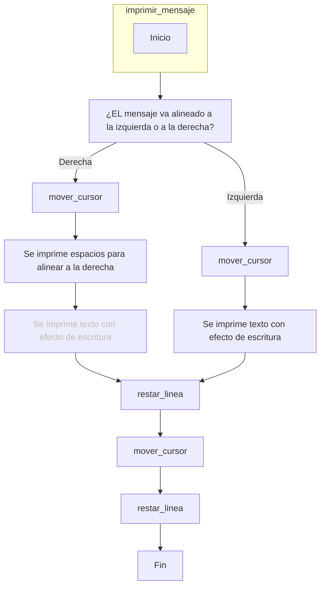
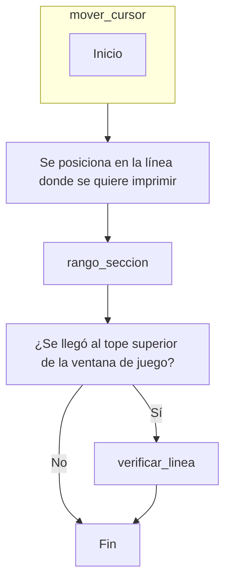

# Proyecto programación: Sombras de una muerte
### Equipo y Logo: Pantalla Azul :/

<div align='center'>
<figure> </br>
</figure>

</div> 

### Integrantes:

1. Joseph Lievano (1052383083)
2. Juan José Tobar Álvarez (1112042373)

# Índice
1. [Historia](#historia)
2. [Funcionamiento](#funcionamiento)
    1. [Estructura general del juego](#estructura-general-del-juego)
        
        1. [Inicialización de variables para la ventana de juego](#inicialización-de-variables-para-la-ventana-de-juego)
        
        2. [Función imprimir_ventana](#función-imprimir_ventana)
        
        3. [Función obtener_mensajes_arcos](#función-obtener_mensajes_arcos)

           3.1. [Función imprimir_nombre_arco](#función-imprimir_nombre_arco)

            3.2. [Función pasar_información](#función-pasar_información)

              3.1.1 [Función borrar_pantalla](#función-borrar_pantalla)

              3.1.2 [Función imprimir_mensaje](#función-imprimir_mensaje)
              - [Función mover_cursor](#función-mover_cursor)
                    a.[Función rango_seccion](#función-rango_seccion)
                    b.[Función verificar_linea](#función-verificar_linea)
              - [Función restar_linea](#función-restar_linea)

              3.1.3 [Función imprimir_imagen](#función-imprimir_imagen)

              3.1.4 [Función imprimir_alternativas](#función-imprimir_alternativas)
## Historia
Nombre: Sombras de una muerte

Resumen: El detective Mendoza tiene una vida normal resolviendo crímenes, hasta que sucede la muerte de un ser querido. En principio no significa mucho, un caso más en el historial. Pero esto le termina arrebatando lo que más quiere en el mundo y haciéndole reencontrarse con un viejo conocido.

## Funcionamiento
Versión de python requerida: 3.6 en adelante

Tipo de juego: Novela visual de arte ASCII

La siguiente sección contiene el diagrama de flujo del juego. Se empieza con una estructura general y seguida de esta se presentan las explicaciones específicas.
## Estructura general del juego


### Inicialización de variables para la ventana de juego
Para la impresión de la ventana de juego se establece que:     
* El ancho de la pantalla es de 80 caracteres.
* La altura de la ventana de diálogo es de 15 caracteres.
* La altura de la ventana de interación es de 8 caractres.
* El ancho máximo del texto impreso en la ventana de diálogo es de 60 caracteres.
```python
ancho_pantalla = 80
altura_dialogo = 15
altura_interaccion = 8
ancho_texto = ancho_pantalla - 20
```
Además, el archivo JSOn con la histora está organizado de la siguiente manera, cada bloque con sus parámetros:
```python
{
  "arco1": {
    "titulo": "El Inicio",
    "mensajes": [
      {
        "id": "mensaje1",
        "texto": "Hora: 5:34 am - 5 de septiembre\n",
        "orientacion": true
      }
    ]
   }
}
```
### Función imprimir_ventana

La función imprimir_ventana se encarga de imprimir la ventana de juego con unas dimensiones establecidas.
```python
def imprimir_ventana(ancho_pantalla : int, altura_dialogo : int, 
                     altura_interaccion: int):
    """
    Imprime una representación de una ventana de diálogo con una sección de
    interacción en la consola.
    

    Args:
        ancho_pantalla (int): El ancho de la ventana.

        altura_dialogo (int): La altura de la sección de diálogo de la ventana.

        altura_interaccion (int): La altura de la sección de interacción de la
        ventana.
        
    Returns:
        None
    """
    # Imprimir la línea superior de la ventana
    print("-" * (ancho_pantalla + 2))
    
    # Imprimir la sección de diálogo de la ventana
    for _ in range(altura_dialogo):
        print("|" + " " * ancho_pantalla + "|")
    
    # Imprimir la línea divisoria entre la sección de diálogo y la de interacción
    print("-" * (ancho_pantalla + 2))
    
    # Imprimir la sección de interacción de la ventana
    for _ in range(altura_interaccion):
        print("|" + " " * ancho_pantalla + "|")
    
    # Imprimir la línea inferior de la ventana
    print("-" * (ancho_pantalla + 2))
```
### Función obtener_mensajes_arcos

La función obtener_mensajes_arcos se encarga de tomar mensaje por mensaje, teniendo en cuenta en qué arco se esta jugando.
```python
def obtener_mensajes_arcos(linea_actual):
    paquete_mensajes = []
    # Se abre el archivo "historia.json" en modo lectura con codificación utf-8
    with open("historia_prueba.json", "r", encoding="utf-8") as archivo:
        # Se lee el contenido del archivo
        contenido = archivo.read()

    # Se carga el contenido JSON en un diccionario de datos
    datos_lectura = json.loads(contenido)

    contador_arcos = 0
    nombres_arcos = list(datos_lectura.keys())
    lista_avance = []
    arco_actual = nombres_arcos[contador_arcos]

    while contador_arcos < len(nombres_arcos):
    # for nombre_arco, contenido_arco in datos_lectura.items():

        imprimir_nombre_arco(arco_actual)
        lista_avance.append(arco_actual)

        contenido_mensajes = datos_lectura[arco_actual].get("mensajes")

        cantidad_seccion = 0

        paquete_mensajes = []

        for mensaje in contenido_mensajes:
            paquete_mensajes.append(mensaje)

        pasar_informacion(paquete_mensajes, linea_actual, cantidad_seccion)

        contador_arcos += 1

        bandera_arco = True

        (bandera_arco, 
         contador_arcos, nombres_arcos) = terminar_juego(bandera_arco, contador_arcos, 
                                                         nombres_arcos)

        while bandera_arco == True:
            (arco_actual, lista_avance, 
             contador_arcos, bandera_arco) = restaurar_arco(contador_arcos, lista_avance, 
                                                            arco_actual, nombres_arcos, 
                                                            bandera_arco)
            
    linea = 22
    posicionar_linea(linea)
    for _ in range(2):
        print("|"+" " * 80)

    linea = 1
    posicionar_linea(linea)                                                      
    mensaje_final = ("| Gracias por jugar. ¡Hasta la próxima!\n\n"
                     "| Créditos:\n| Programado y escrito por:"
                     " Juan José Tobar y Jospeh Lievano")

    for caracter in mensaje_final:
        print(caracter, end="", flush=True)
        sleep(0.03)

    linea = 26
    posicionar_linea(linea)  

    return None
```
### Función imprimir_nombre_arco

La función imprimir_nombre_arco se encarga de tomar el nombre del arco e imprimirlo.
```python
def imprimir_nombre_arco(nombre_arco):
    linea = 1
    posicionar_linea(linea)

    nombre_arco = nombre_arco[:-1].capitalize() + " " + nombre_arco[-1::]
    print("| ", end = "")

    for caracter in nombre_arco:
        print(caracter, end="", flush=True)
        sleep(0.1)

    linea = 23
    posicionar_linea(linea)
    input("| Presione enter para continuar:")
```
### Función pasar_información

La función pasar_información se encarga de tomar la información en el JSON, por bloques, e imprimir de acuerdo a los criterios que da el bloque.
```python
def pasar_informacion(paquete_mensajes, linea_actual, cantidad_seccion):
    
    lista_secciones = []

    constante_linea =  1
    constante_rango = 1

    for paquete in paquete_mensajes:

        orientacion_paquete = []

        mensaje_actual = (paquete.get("texto"))

        orientacion_paquete.append(paquete.get("orientacion"))
        orientacion_paquete.append(mensaje_actual)

        lista_secciones.append(orientacion_paquete)

        (linea_actual, cantidad_seccion, 
         constante_linea, constante_rango, lista_secciones) = imprimir_mensaje(linea_actual, 
                                                              cantidad_seccion, lista_secciones, 
                                                              constante_linea, constante_rango)
        
        linea = 23
        posicionar_linea(linea)

        input("| Presione enter para continuar:")

        if paquete.get("imagen"):
            archivo_imagen = paquete.get("imagen")
            borrar_pantalla( )
            imprimir_imagen(archivo_imagen )

        if paquete.get("alternativas"):
            alternativas = paquete.get("alternativas")

            (linea_actual, cantidad_seccion, 
            constante_linea, constante_rango,  lista_secciones) = recorrer_alternativas(alternativas, linea_actual, 
                                                                                       cantidad_seccion, constante_linea, constante_rango, lista_secciones)


    borrar_pantalla( )
```
### Función borrar_pantalla

La función borrar_pantalla se encarga de imprimir una nueva linea en blanco, dando el efeco de borrado.
```python
def borrar_pantalla( ):

    LINE_UP = '\033[1A'  # Secuencia de escape ANSI para mover el cursor hacia arriba
    
    # Mover el cursor hacia arriba 100 líneas
    for _ in range(100):
        print(LINE_UP, end="")

    print("")  # Imprimir una línea en blanco para separar el contenido

    # Imprimir líneas vacías para simular el borrado de la pantalla
    for _ in range(15):
        print("|" + " " * 80)
```
### Función imprimir_mensaje

La función imprimir_mensaje se encarga de imprimir los mensajes ya rebanados en frases y con la ilusión de que se están escribiendo las palabras por teclado.
El criterio para dividir los mensajes en frases es la longitud de las frases establecida por la variable ancho_texto.
```python
def imprimir_mensaje(seccion_escritura: list, lista_mensajes: list, linea_actual: int,
                     ancho_pantalla: int, sublista: int, rango_mensaje: int):
    """
    Imprime un mensaje sección por sección con un efecto de escritura.

    Args:
        seccion_escritura (list): Lista de secciones de texto a imprimir.

        lista_mensajes (list): Lista de listas que contiene los mensajes y
        su estado de visualización.

        linea_actual (int): Línea actual en la pantalla donde se imprimirá.

        ancho_pantalla (int): Ancho de la pantalla para ajustar el texto.

        sublista (int): Índice de la sublista en 'lista_mensajes' que contiene 
        el mensaje a imprimir.

        rango_mensaje (int): Rango del mensaje a imprimir en la pantalla.

    Returns:
        tuple: Una tupla que contiene la línea actual y el rango de mensaje
        actualizados.
    """
    # Verificar si el mensaje en la sublista está activo para impresión
    if lista_mensajes[sublista][0] == True:

        # Mover el cursor y obtener la línea actual y rango de mensaje
        linea_actual, rango_mensaje = mover_cursor(linea_actual, rango_mensaje,
                                                   lista_mensajes)
        
        print("| ", end="")  # Imprimir el delimitador inicial de la línea

        # Iterar sobre cada palabra en la sección de escritura
        for palabra in seccion_escritura:

            # Imprimir cada carácter de la palabra con un efecto de escritura
            for caracter in palabra:
                print(caracter, end="", flush=True)
                sleep(0.02)  # Pausa breve para efecto de escritura
            
            # Borrar la pantalla después de imprimir una palabra
            borrar_pantalla(ancho_pantalla)

            # Ajustar la línea actual y rango de mensaje después de la impresión
            linea_actual -= 1
            rango_mensaje -= 1

            # Mover el cursor de nuevo para la siguiente palabra
            linea_actual, rango_mensaje = mover_cursor(linea_actual, rango_mensaje,
                                                       lista_mensajes)
            print("| ", end="")  # Imprimir el delimitador de la nueva línea

    else:
        # Si el mensaje no está activo, borrar la pantalla
        borrar_pantalla(ancho_pantalla)
        linea_actual -= 1

        # Mover el cursor y obtener la línea actual y rango de mensaje
        linea_actual, rango_mensaje = mover_cursor(linea_actual, rango_mensaje,
                                                   lista_mensajes)
        print('\n', end="")  # Mover a la nueva línea sin imprimir nada

        # Iterar sobre cada palabra en la sección de escritura
        for palabra in seccion_escritura:
            print("|" + " " * 18, end="")  # Imprimir espacio inicial

            # Imprimir cada carácter de la palabra con un efecto de escritura
            for caracter in palabra:
                print(caracter, end="", flush=True)
                sleep(0.02)  # Pausa breve para efecto de escritura

            # Borrar la pantalla después de imprimir una palabra
            borrar_pantalla(ancho_pantalla)

            # Ajustar la línea actual y rango de mensaje después de la impresión
            linea_actual -= 1
            rango_mensaje -= 1

            # Mover el cursor de nuevo para la siguiente palabra
            linea_actual, rango_mensaje = mover_cursor(linea_actual, rango_mensaje,
                                                       lista_mensajes)

    # Retornar la línea actual y rango de mensaje actualizados
    return linea_actual, rango_mensaje
```
### Función mover_cursor

La función mover_cursor se encarga de mover el cursor a la línea donde se va imprimiendo el mensaje, teniendo también en cuenta cuántas líneas caben en la pantalla de juego.
```python
def mover_cursor(linea_actual: int, cantidad_seccion: int, 
                 lista_secciones: list, 
                constante_linea, constante_rango):

    LINE_UP = '\033[1A'  # Secuencia de escape ANSI para mover el cursor arriba
    
    # Mover el cursor hacia arriba 100 líneas
    for _ in range(100):
        print(LINE_UP, end="")

    # Imprimir líneas vacías hasta alcanzar la línea actual
    for _ in range(linea_actual):

        # Si es la última línea y no es la 14, ajustar el rango del mensaje
        if _ == linea_actual - 1 and _ != 14:
            print("")
            cantidad_seccion, linea_actual = rango_seccion(lista_secciones, cantidad_seccion, linea_actual)
        

        else:
            print("")  # Imprimir línea vacía
    
    if _ == 0 and linea_actual == 1:

        (linea_actual, constante_linea, 
         constante_rango, lista_secciones) = verificar_linea(linea_actual, constante_linea, 
                                                             constante_rango, lista_secciones)

                                        

    # Devolver la línea actual y el rango de mensaje actualizados
    return linea_actual, cantidad_seccion, constante_linea, constante_rango, lista_secciones

def restar_linea(linea_actual, cantidad_seccion, constante_rango):

    if linea_actual != 1 and cantidad_seccion != 10:
        linea_actual -= 1

    elif linea_actual == 1 and cantidad_seccion == 7:
        linea_actual = 2
        constante_rango = 0


    return linea_actual, cantidad_seccion, constante_rango
```
### Función rango_seccion

La función rango_seccion se encarga de poner el mensaje dentro del rango que se puede en la pantalla de juego.
```python
def rango_seccion(lista_secciones: list, cantidad_seccion: int, linea_actual):

    i = 0         # Inicializa el índice de la línea actual
    seccion = 0   # Inicializa el índice de la sección actual

    # Bucle para ajustar el rango de la sección a mostrar
    while i < cantidad_seccion :
        

        # Llama a imprimir_seccion para mostrar la sección actual
        seccion, i, lista_secciones = imprimir_seccion(lista_secciones, seccion, i)

            # Actualizar los índices para la próxima sección
        seccion += 1
        i += 1
    return cantidad_seccion, linea_actual  # Retorna el rango de mensaje ajustado
```
### Función verificar_linea

La función verificar_linea se encarga de hacer que la linea quede en su lugar sin mover otros elementos.
```python
def verificar_linea(linea_actual, constante_linea, constante_rango, lista_secciones):

    constante_linea = 0
    constante_rango = 0

    lista_secciones.pop(0)
    
    return linea_actual, constante_linea, constante_rango, lista_secciones
```
### Función restar_linea

La función restar_linea se encarga de quitar las líneas que van saliendo de la pantalla de juego.
```python
def restar_linea(linea_actual, cantidad_seccion, constante_rango):

    if linea_actual != 1 and cantidad_seccion != 10:
        linea_actual -= 1

    elif linea_actual == 1 and cantidad_seccion == 7:
        linea_actual = 2
        constante_rango = 0

```
### Función imprimir_imagen

La función imprimir_imagen se encarga de imprimir las imágenes ASCII.
```python
def imprimir_imagen(archivo_imagen):
    
    linea = 1
    posicionar_linea(linea)

    with open(archivo_imagen, 'r') as archivo:
        arte_ascii = archivo.read()

    for caracter in arte_ascii:
        print(caracter, end="", flush=True)
        sleep(0.005)
    
    linea = 23
    posicionar_linea(linea)

    input("| Presione enter para continuar:")
```
### Función imprimir_alternativas

La función imprimir_alternativas se encarga de imprimir las opciones del jugador, luego imprime la respuesta a esa elección.
```python
def imprimir_alternativas(alternativas):
    
    LINE_UP = '\033[1A'
    for clave, valor in alternativas.items():
        posibilidad = "| " + clave + ") " + valor[0]

        for caracter in posibilidad:
            print(caracter, end="", flush=True)
            sleep(0.02)

    linea = 22
    posicionar_linea(linea)
    for _ in range(2):
        print("|" + " " * 70)

    print(LINE_UP, end="")
    opcion = input("| Seleccione una opción:").lower().replace(" ", "")

    return opcion, alternativas
```
